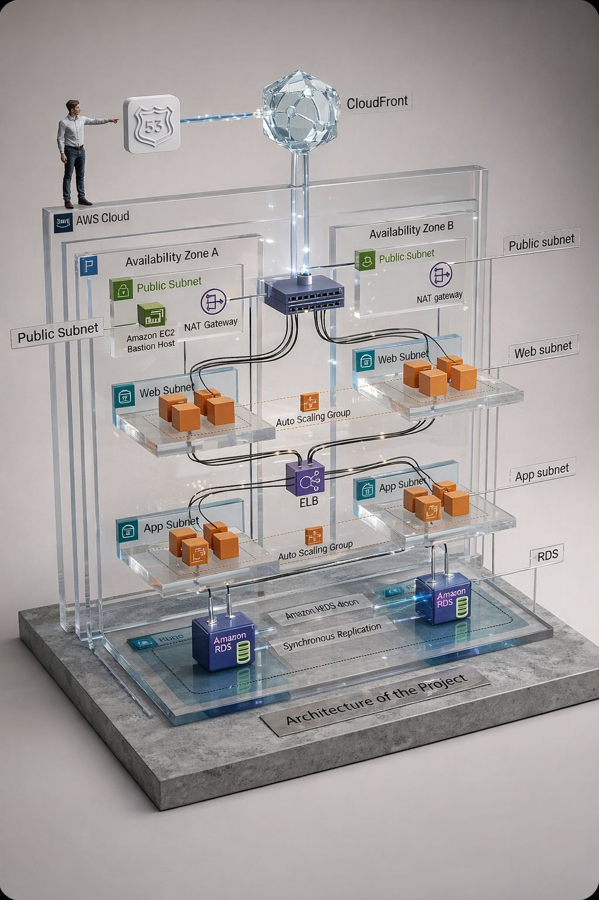
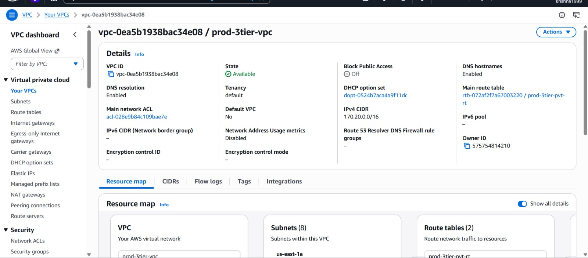
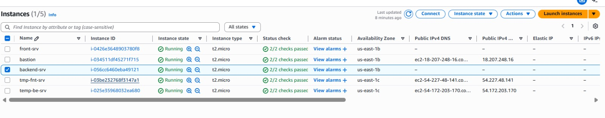
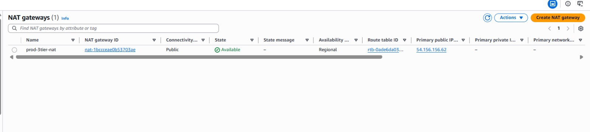
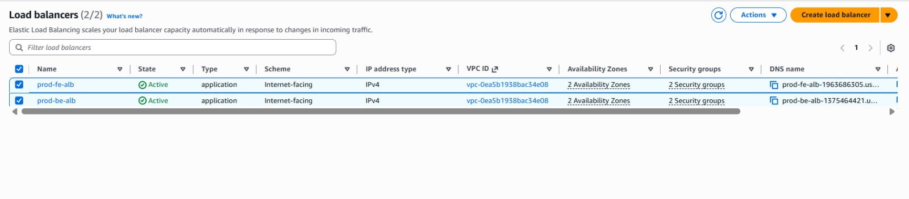
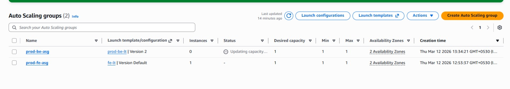
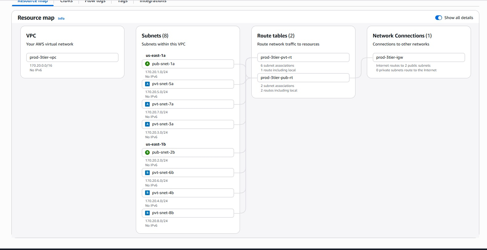
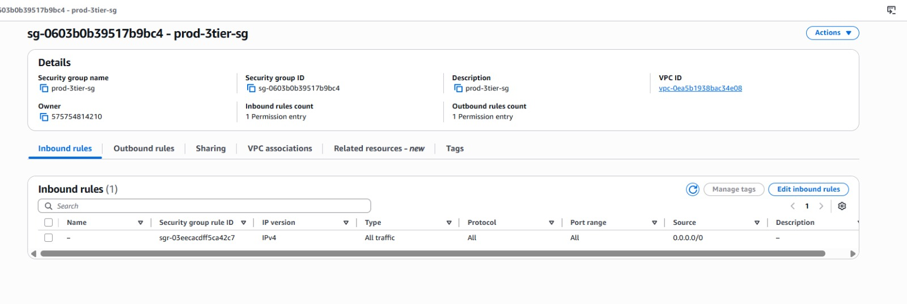
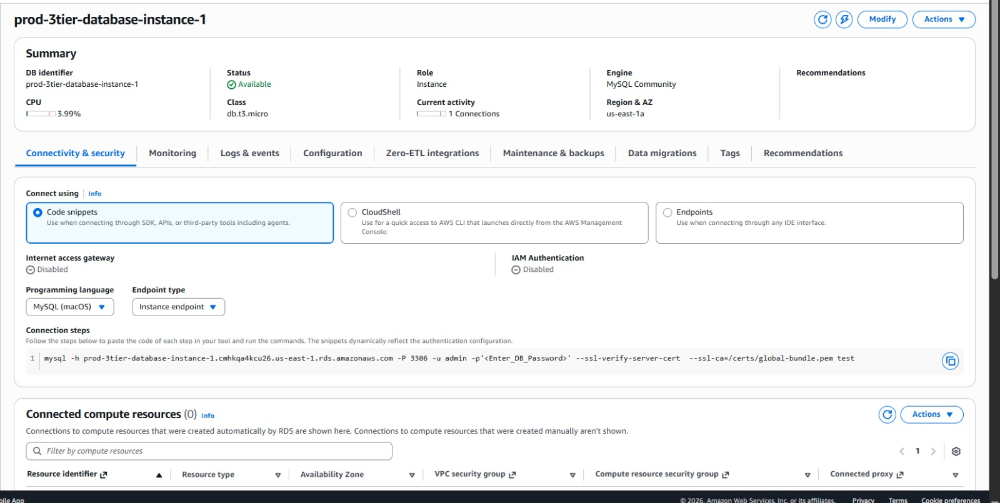
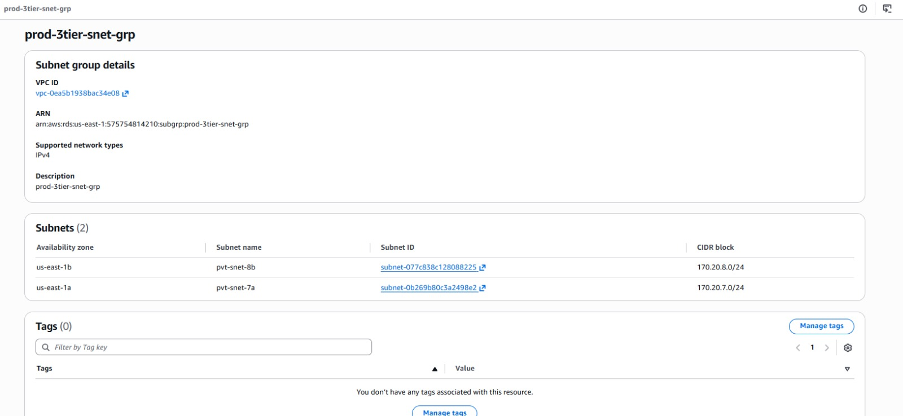

# AWS Three-Tier Architecture Project

This project demonstrates a **Highly Available Three-Tier Architecture deployed on AWS**.  
The architecture is designed using best practices for **scalability, high availability, and security**.

The infrastructure is deployed across **multiple Availability Zones** to ensure fault tolerance and improved reliability.

---

# Architecture Diagram

---

# Project Overview

A **three-tier architecture** separates an application into three layers:

1. Presentation Layer (Web Tier)
2. Application Layer (App Tier)
3. Data Layer (Database Tier)

This architecture improves **scalability, maintainability, and security**.

---

# Architecture Flow

User → Route53 → CloudFront → External Load Balancer → Web Tier (Auto Scaling EC2) → Internal Load Balancer → App Tier (Auto Scaling EC2) → Amazon RDS Database

---

# AWS Services Used

The following AWS services were used in this project:

- Amazon VPC
- Public Subnets
- Private Subnets
- Internet Gateway
- NAT Gateway
- Bastion Host (EC2)
- EC2 Instances
- Application Load Balancer (ALB)
- Auto Scaling Groups
- Amazon RDS
- Route53
- CloudFront
- Security Groups

---

# Architecture Components

## VPC
A custom **Virtual Private Cloud (VPC)** is created to isolate the infrastructure.

---

## Public Subnets
Public subnets contain:

- Bastion Host
- NAT Gateway
- Internet-facing Load Balancer

These resources allow secure communication with the internet.

---

## Web Tier

The **Web Tier** handles incoming user requests.

Features:

- EC2 instances
- Auto Scaling Group
- Private Web Subnets
- External Load Balancer

---

## Application Tier

The **Application Tier** processes business logic.

Features:

- EC2 instances
- Auto Scaling Group
- Private App Subnets
- Internal Load Balancer

---

## Database Tier

The **Database Tier** stores application data.

Features:

- Amazon RDS
- Multi-AZ Deployment
- DB Subnet Group

---

# High Availability

This architecture ensures high availability using:

- Multiple Availability Zones
- Load Balancers
- Auto Scaling Groups
- RDS Multi-AZ

---

# Security

Security best practices used:

- Private subnets for application and database tiers
- Bastion Host for secure SSH access
- Security Groups controlling inbound and outbound traffic
- NAT Gateway for secure outbound internet access

---

# Project Steps

1. Create a Custom VPC
2. Create Public and Private Subnets
3. Attach Internet Gateway
4. Configure NAT Gateway
5. Create Bastion Host
6. Configure Application Load Balancer
7. Launch EC2 Instances
8. Configure Auto Scaling Groups
9. Deploy Application Tier
10. Create RDS Database
11. Configure Route53 and CloudFront

---

# Screenshots

Screenshots of AWS resources are available in the **screenshots** directory.

Examples:

- VPC configuration
- Subnets
- Load Balancer
- Auto Scaling Group
- RDS database

---

# Learning Outcomes

This project helped me understand:

- AWS networking architecture
- Designing scalable cloud systems
- Implementing high availability
- Configuring load balancers and auto scaling
- Securing cloud infrastructure

---

# Future Improvements

- Add AWS WAF for security
- Add CloudWatch monitoring
- Implement CI/CD pipeline
- Deploy containerized applications using Docker
- Use Infrastructure as Code (Terraform)

---

# Author

Krishna Vamsy

GitHub: https://github.com/KrishnaVamsy99
